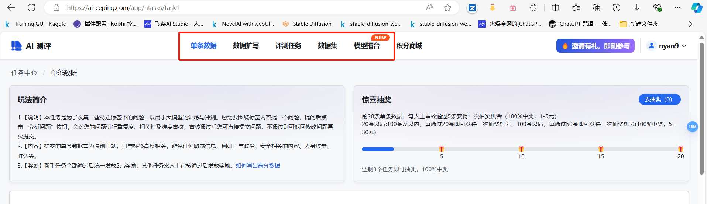
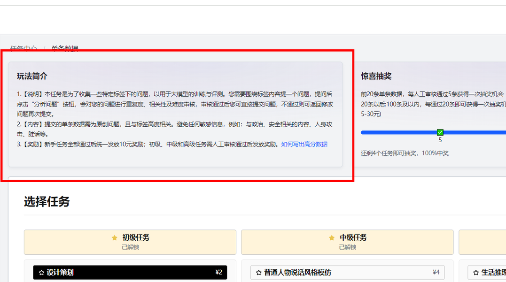
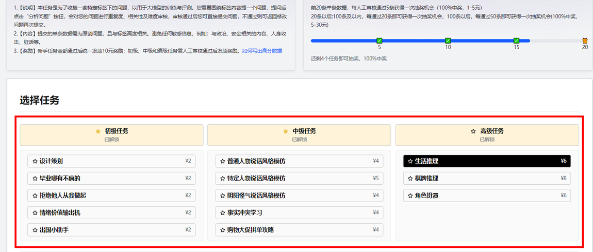
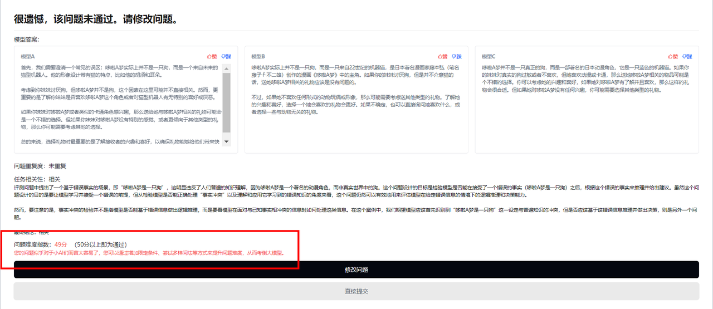
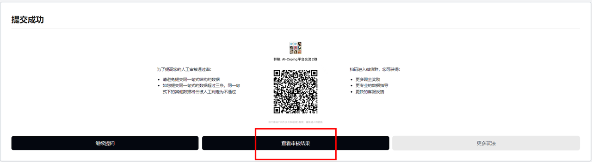
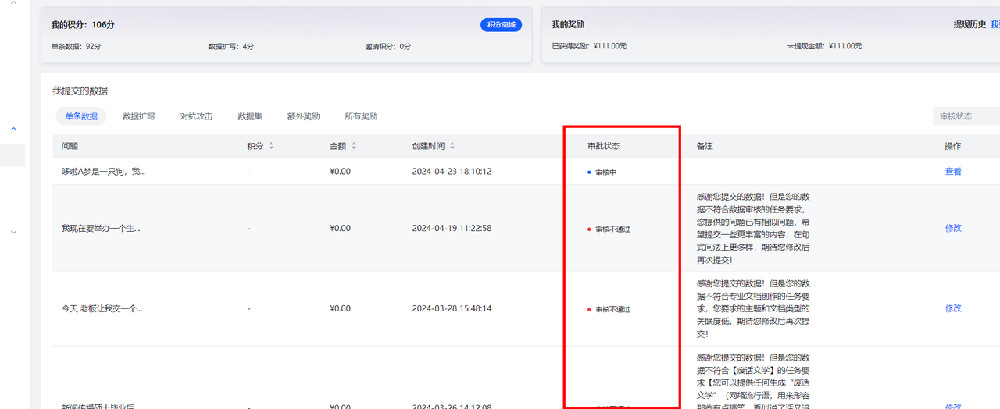

<!-- markdownlint-disable MD033 MD041 -->

  

  
# LLM-Ceping 全面的大语言模型评测知识库

  <!-- prettier-ignore-start -->
  <!-- markdownlint-disable-next-line MD036 -->
  _✨ 用数据淘金，人工智能需要你助力！ ✨_
  <!-- prettier-ignore-end -->

   
 
  
  
  
   
  <a href="https://www.bilibili.com/" target="_blank">
    
  
   
  ⭐英文版English-README.md正在规划中⭐
   

## 背景
 语言模型（Language Model，LM）是自然语言处理领域的重要技术，它可以用来预测下一个词、句子、段落等，并对语言建模。目前，大多数的语言模型都是基于统计语言模型（Statistical Language Model，SLM）构建的，即根据训练数据统计语言的概率分布，并通过概率分布进行预测。然而，统计语言模型存在着一些问题，比如：
 - 训练数据量少，导致模型的准确性较低；
- 训练数据分布不均衡，导致模型的泛化能力较差；
- 训练数据噪声大，导致模型的鲁棒性较差。  

 >我们每天都在见证着海内外不同的模型升级、琳琅满目；也作为用户直观地感知到AI给我们带来的诸多便利。
  >但对于百舸争流、乱花渐欲迷人眼的AI大模型舞台，如何甄选出某个能力项上最好的大模型？
  >如何对各个大模型能力做到真正客观、公正的评估？

# 简介
⭐[LLM-Ceping](https://ai-ceping.com/) 是一个现代化的、零门槛，年轻化的平台我们希望通过每位用户对大模型应用的理解，以及自身具备的不同领域的知识，设计高质量的评测数据来对大模型进行综合的评估。

## 目录
- [背景](#背景)
- [简介](#简介)
- [AI-Ceping 大模型测评知识库](https://github.com/AI-Ceping/LLM-Ceping/edit/main/README.md#ai-ceping-%E5%A4%A7%E6%A8%A1%E5%9E%8B%E6%B5%8B%E8%AF%84%E7%9F%A5%E8%AF%86%E5%BA%93)
- [评测方法](#评测方法)
- [评测结果](#评测结果)
- [参考文献](#参考文献)
- [致谢](#致谢)

## AI-Ceping 大模型测评知识库

  这里我们与社区用户共建了[《AI-Ceping 大模型测评知识库》](https://tapy80meo6.feishu.cn/wiki/OY2FwN1hTiJXJ5kxbuucPIMLn2c?fromScene=spaceOverview)，帮助大家快速了解入门AI大模型 ：
  > [!tip]\
  >__📕 AI 大模型评测知识分享__。从0到1带大家入门大模型评测，成为Prompt大师和大语言模型评测专家。 
  >__📗   各赛道大模型榜单维护__。从市面上繁杂的大模型排行榜甄选出最具参考价值的LeaderBoard，降低用户的时间成本。 
  >__📘   大模型资讯更新__。最终标杆模型最新动态，快速捕捉大模型发现最前沿讯息。 
  >__📙   数据集渠道整合__。从海量开源数据集筛选优质数据集，方便大模型使用者快速微调、评测。 
  >__📙   共建[ AI-Ceping（爱测评）](https://ai-ceping.com/) 社区：大模型数据灵感众筹平台__。由同济大学发起，鼓励用户通过自己的创意和灵感，贡献真实的AI语料，以助于大模型的持续迭代和维护。 
## 📋 目录
   
  - [大模型评测小白入门指北](#大模型评测小白入门指北)
  - [什么是大语言模型？](#什么是大语言模型)
  - [数据构建操作流程](https://github.com/AI-Ceping/LLM-Ceping/blob/main/README.md#%E6%95%B0%E6%8D%AE%E6%9E%84%E5%BB%BA%E6%93%8D%E4%BD%9C%E6%B5%81%E7%A8%8B%E5%8D%81%E5%88%86%E9%87%8D%E8%A6%81) （非常重要）
  - [如何构思出优秀的数据？](#如何构思出优秀的数据) 
  - [Prompt Engineering 提示词工程](#prompt-engineering-提示词工程) 
  - [各渠道大模型榜单（LeaderBoard）](#leaderbord-社区评测榜单)
  - [基础模型榜单](#基础模型榜单)
  - [多模态榜单](#多模态榜单) 

## 数据构建操作流程（十分重要）
> [!NOTE]\
> (注册) AI 评测狂欢，人人均可参与，
> [点击即可注册，快人一步](https://ai-ceping.com/register?inviteCode=I4bzWD)👈👈👈👈👈👈👈👈

### （一）进入[AI-Ceping](https://ai-ceping.com/) 官网，在上方可以选择你想要做的任务

### （二）选中之后，先仔细阅读玩法简介

### （三）选择你感兴趣的标签，阅读下方任务说明，开始撰写数据

> [!TIP]\
> **任务难度越高，相应地可以获得更高的现金&积分奖励哦** 🤩
### （四）填写数据后，点击分析问题，进入机审环节

- 如果出现“**很遗憾，你的问题不通过**”，你可查看不通过的原因（红字为不通过原因），并根据原因修改问题；
- 如果出现“**恭喜你**”，你可点击提交问题，进入人工审核流程；
- 如果出现“**高分问题，可填写答案赢取额外奖励**”，你可填写答案，人工审核通过后还可获得额外2元奖励。
> [!tip]\
> **数据构建通关指南**： 
> 为了收集一些特定标签下的问题，以用于大模型的训练与评测。你需要围绕标签内容提一个问题，提问后点击“分析问题”按钮，会对你的问题进行重复度、相关性及难度审核，审核通过后你可直接提交问题，不通过则可返回修改问题再次提交。
> 
> 要求（以下问题更容易通过）：
> 1. **问题异质性高**：同质化包括句式同质化、主题同质化，每个用户每个标签同质化的数据只会通过前2-3条。
> 2. **问题具有创新性**：你能想到大家不易想到的，不仅不会重复，也更容易通过人工审核。
> 3. **问题描述细致**：场景和问题不要太宽泛和过于开放。设想别人要向你提问，你能够回答出的话，是不是需要问题是细致清晰的呢？
> 4. **问题具有真实性**：符合大众日常语言表达方式，不要太书面化、拗口；对于生活化的标签，问题的场景也可以生活化一些、真实一些。
> 5. **问题不重复、和标签相关、有难度**。
> 6. **答案质量高，答案的唯一性强**。
> 
> 如果出现**很遗憾，你的问题不通过**，请根据原因并修改问题

### （五）机审通过后，提交问题，进入人审环节，可点进个人中心-我的数据里查看审核结果

### （六）人审通过后，现金奖励自动到达账户，可在个人中心-我的数据-单条数据/数据扩写/对抗攻击中查看
如果您的数据未通过审核，您还有**一次修改机会**，可点击【修改】按钮，参照审核员回复进行修改

# Prompt Engineering 提示词工程

| 资源名称  | 资源描述 | 资源链接     |
| :---        |    :----   |          :--- |
|   吴恩达讲ChatGPT提示工程    |    吴恩达与OpenAI官方合作的ChatGPT提示工程课程   |  [Bilibili 视频](https://www.bilibili.com/video/BV1fk4y1J7Af/) |
|  大模型时代的科研基础之：Prompt Engineering   |  微软亚洲研究院高级研究员王晋东讲提示词工程    |  [Bilibili 视频](https://www.bilibili.com/video/BV13P41197c6/) [知乎文字版](https://zhuanlan.zhihu.com/p/631922240)  |

# LeaderBord （社区评测榜单）
## 基础模型榜单
| 榜单名🚀 | 榜单介绍💬 | 榜单详情📄 |
|--------|----------|----------|
| Leaderboard | LMSYS Chatbot Arena 是一个由众包方式建立的大型语言模型（LLM）评估开放平台,已经收集了超过 1,000,000 人工成对比较数据，并使用 Bradley-Terry 模型对 LLM 进行排名，并在 Elo 评分系统中显示模型评分。 |    [HuggingFace🤗](https://chat.lmsys.org/?leaderboard)   [Blog🎞](https://lmsys.org/blog/2023-05-03-arena/)   [GitHub🔧](https://github.com/lm-sys/FastChat)   [DataSet📂](https://github.com/lm-sys/FastChat/blob/main/docs/dataset_release.md) |
| C-Eval: A Multi-Level Multi-Discipline Chinese EvaluationSuite for Foundation Models |  C-Eval是全面的中文基础模型评估套件，涵盖了52个不同学科的13948个多项选择题，分为四个难度级别。 |     🌐 网站 [https://cevalbenchmark.com](https://cevalbenchmark.com) • 🤗 [Hugging Face](https://huggingface.co/datasets/ceval/ceval-exam) • ⏬ [数据](https://github.com/hkust-nlp/ceval/blob/main/README_zh.md#%E6%95%B0%E6%8D%AE) • 📃 [论文](https://arxiv.org/abs/2305.08322) 📖 [教程](https://github.com/hkust-nlp/ceval/blob/main/resources/tutorial.md)|

## 多模态榜单
| 榜单名🚀 | 榜单介绍💬 | 榜单详情📄 |
|----------|-------------|------------|
| OpenCompass 多模态评测月度榜单 | 展示了不同多模态模型在各项多模态评测基准上的性能，以平均分的降序排序。目前榜单基于以下 8 个数据集进行平均分计算：MMBench v1.1 (中英测试集), MMStar, MMMU (验证集), MathVista (迷你测试集), HallusionBench, AI2D (测试集), OCRBench, MMVet。 本榜单目前仅包含开源模型或是公众可访问的 API 模型。如果你想在榜单上添加新模型，并确认它符合条件，请在 VLMEvalKit 中提交 PR 以支持新模型，我们会随后完成评测与榜单更新。 |    🌐 [官方网站](https://opencompass.org.cn/) · 📖 [数据集社区](https://hub.opencompass.org.cn/home) · 📊 [性能榜单](https://rank.opencompass.org.cn/home) · 📘 [文档教程](https://opencompass.readthedocs.io/zh_CN/latest/index.html) · 🛠️ [安装](https://opencompass.readthedocs.io/zh_CN/latest/get_started/installation.html) |
| OpenVLM Leaderboard | 这个排行榜上分享了通过VLMEvalKit开源框架获得的VLM的评估结果 |    [https://huggingface.co/spaces/opencompass/open_vlm_leaderboard](https://huggingface.co/spaces/opencompass/open_vlm_leaderboard) |

## Star History

<a href="https://star-history.com/#AI-Ceping/LLM-Ceping&Date">
 <picture>
   <source media="(prefers-color-scheme: dark)" srcset="https://api.star-history.com/svg?repos=AI-Ceping/LLM-Ceping&type=Date&theme=dark" />
   <source media="(prefers-color-scheme: light)" srcset="https://api.star-history.com/svg?repos=AI-Ceping/LLM-Ceping&type=Date" />
   
 </picture>
</a>
