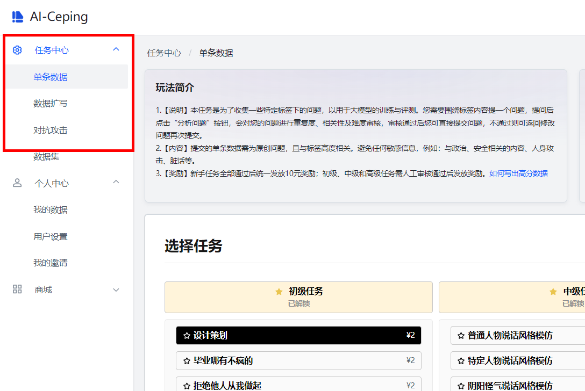
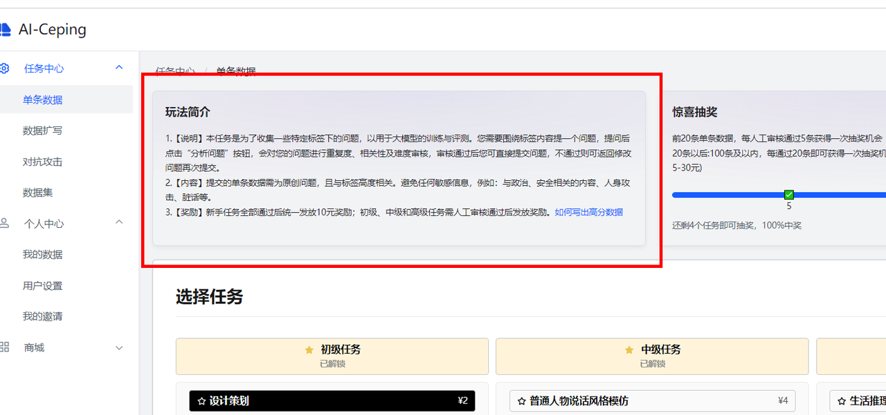
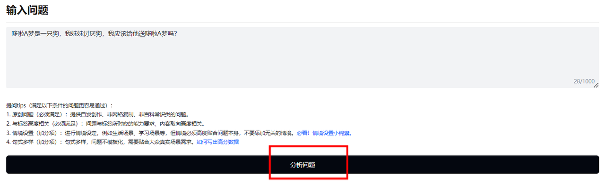
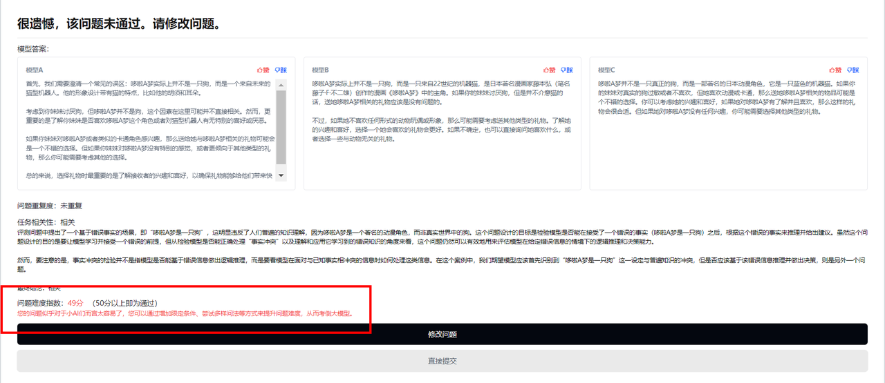
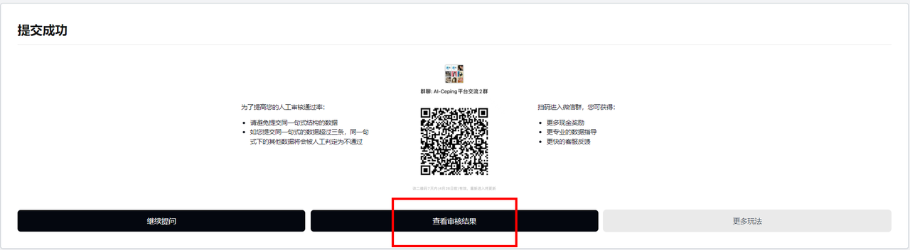
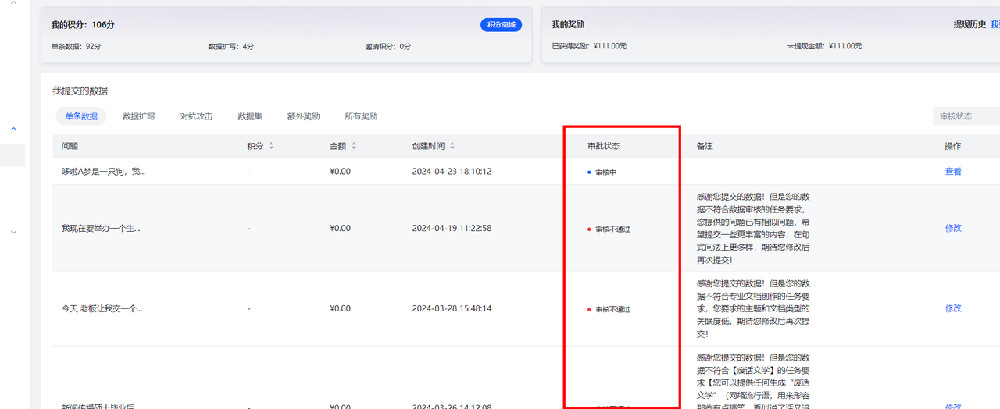

<!-- markdownlint-disable MD033 MD041 -->

  

  
# LLM-Ceping 全面的大语言模型评测知识库

  <!-- prettier-ignore-start -->
  <!-- markdownlint-disable-next-line MD036 -->
  _✨ 用数据淘金，人工智能需要你助力！ ✨_
  <!-- prettier-ignore-end -->

   
 
  
  
  
  
   
  ⭐英文版English-README.md正在规划中⭐
   

# 简介

⭐[LLM-Ceping](https://ai-ceping.com/) 是一个现代化的、零门槛，年轻化的平台
我们希望通过每位用户对大模型应用的理解，以及自身具备的不同领域的知识，设计高质量的评测数据来对大模型进行综合的评估。

## LLM-Ceping 
  
  >我们每天都在见证着海内外不同的模型升级、琳琅满目；也作为用户直观地感知到AI给我们带来的诸多便利。
  >但对于百舸争流、乱花渐欲迷人眼的AI大模型舞台，如何甄选出某个能力项上最好的大模型？
  >如何对各个大模型能力做到真正客观、公正的评估？

  这里我们与社区用户共建了《AI-Ceping 大模型测评知识库》，帮助大家快速了解入门AI大模型 ：
  > [!tip]\
  >__📕 AI 大模型评测知识分享__。从0到1带大家入门大模型评测，成为Prompt大师和大语言模型评测专家。 
  >__📗   各赛道大模型榜单维护__。从市面上繁杂的大模型排行榜甄选出最具参考价值的LeaderBoard，降低用户的时间成本。 
  >__📘   大模型资讯更新__。最终标杆模型最新动态，快速捕捉大模型发现最前沿讯息。 
  >__📙   数据集渠道整合__。从海量开源数据集筛选优质数据集，方便大模型使用者快速微调、评测。 
  >__📙   共建[ AI-Ceping（爱测评）](https://ai-ceping.com/) 社区：大模型数据灵感众筹平台__。由同济大学发起，鼓励用户通过自己的创意和灵感，贡献真实的AI语料，以助于大模型的持续迭代和维护。 
## 📋 目录

- 
   
  - [大模型评测小白入门指北](#大模型评测小白入门指北)
  - [什么是大语言模型？](#什么是大语言模型)
  - [数据构建操作流程](https://github.com/AI-Ceping/LLM-Ceping/blob/main/README.md#%E6%95%B0%E6%8D%AE%E6%9E%84%E5%BB%BA%E6%93%8D%E4%BD%9C%E6%B5%81%E7%A8%8B%E5%8D%81%E5%88%86%E9%87%8D%E8%A6%81)
  - [Prompt Engineering 提示词工程](#prompt-engineering-提示词工程) 
  - [各渠道大模型榜单（LeaderBoard）](#leaderbord-社区评测榜单)
  - [基础模型榜单](#基础模型榜单)
  - [多模态榜单](#多模态榜单) 

# 大模型评测小白入门指北
## 什么是大语言模型？

大语言模型（Large Language Model，简称LLM）是一种基于深度学习技术的自然语言处理（NLP）模型。它通过学习大量文本数据来理解、生成和翻译自然语言。典型的大语言模型如OpenAI的GPT系列和Google的BERT模型，能够执行各种语言任务，包括文本生成、语言翻译、文本摘要、问答系统等。

### 1. 什么是大语言模型评测？

大语言模型评测是对大语言模型性能进行系统化和科学化的测试与评估的过程。通过评测，我们可以了解模型在不同语言任务上的表现，判断其优缺点，并发现潜在的问题。这些评测不仅包括准确性和效率等基本指标，还包括模型的鲁棒性、公平性和伦理问题等方面。

### 2. 大语言模型评测的意义

> - **衡量性能**：了解模型在不同任务上的表现，以确保其在实际应用中能够达到预期效果。
> - **指导改进**：通过评测结果，研究人员可以发现模型的不足之处，并进行针对性的改进和优化。
> - **比较不同模型**：通过统一的评测标准，比较不同大语言模型的优劣，帮助用户选择最适合的模型。
> - **确保安全与公平**：评测还可以揭示模型在安全性、公平性和伦理道德方面的问题，推动模型在这些方面的改进。

### 3. 大语言模型评测的方式

大语言模型评测可以采用多种方式，包括但不限于：

> 1. **基准测试（Benchmarking）**：使用一系列标准化的数据集和任务来测试模型的性能。例如，GLUE和SuperGLUE是常用于NLP任务的基准测试。
> 2. **人类评价**：通过人工评审来评估模型生成的文本质量、流畅性和相关性。
> 3. **实际应用测试**：将模型应用于真实场景中，如客户服务、翻译系统等，观察其实际表现。
> 4. **对抗测试**：通过设计一些恶意输入或极端情况来测试模型的鲁棒性和稳定性。
> 5. **公平性和伦理测试**：评估模型在处理不同人群和内容时是否存在偏见，确保其公平和无害。
   

    
    

当下，市面上的评测体系近百个，既有来自专业学术机构的，也有来自市场运作组织的，还有一些媒体也推出了对应的大模型榜单。

### 4. 当前大模型评测体系存在诸多问题

> - **开源评测数据集题目全公开**：由于“刷题”、“背题”现象频发，包括雇佣人类“数据标注员”来做题将答案给到大模型，让GPT-4来答题再将答案用来训练自家大模型，大模型做题就可以“满分”了。
> - **评测数据集本身不科学**：没有科学合理的设置“考题”去评测大模型的各项能力，题目设置过于随意。以及场景错位，比如用中文数据集去考核英文大模型，跟让老外直接来参加高考一样不靠谱；
> - **评测体系不完善**：大部分评测体系是从知识面的角度去考察大模型，缺少对大模型能力的评测和深入分析。使得评测和大模型的研究割裂，无法指导未来的研究。
> - **信息良莠不齐**：据不完全统计，国产大模型已经超过180个。多家国产大模型号称在多个维度已超越OpenAI旗下的GPT-4，且有模有样地晒出对应的大模型评测榜单“跑分”。比如某大模型宣称“基模型12项性能超越GPT-4”。这么多大模型，哪些是真的效果好？在每天冒出来的各类“榜单”上出现了“家家第一”的情况，甚至已不止一款国产大模型“碾压”了GPT-4？为什么在榜单上这么强，但是实际用起来却远不如GPT-4？

### 5. 社群目标

通过 [AI-Ceping](https://ai-ceping.com/) 平台的用户视角，搭建全新的、与时俱进的大模型评测体系：

> - 准确、靠谱、权威的评测体系，可以科学、全面、有效地衡量大模型
> - 评测试题隐私、公正，避免大模型在训练中见过以及背题。
> - 具有指导意义的评测。针对性的评价大模型的各项能力，指导未来大模型的研究方向

## 数据构建操作流程（十分重要）
> [!NOTE]\
> (注册) AI 评测狂欢，人人均可参与，
> [点击即可注册，快人一步](https://ai-ceping.com/register?inviteCode=I4bzWD)👈👈👈👈👈👈👈👈

### （一）打开[AI-Ceping](https://ai-ceping.com/) 官网，点击任务中心—选择你想要完成的任务

### （二）阅读玩法简介

### （三）选择你感兴趣的标签，阅读下方任务说明，开始撰写数据

### （四）填写数据后，点击分析问题，进入机审环节

- 如果出现“很遗憾，你的问题不通过”，你可查看不通过的原因（红字为不通过原因），并根据原因修改问题；
- 如果出现“恭喜你”，你可点击提交问题，进入人工审核流程；
- 如果出现“高分问题，可填写答案赢取额外奖励”，你可填写答案，人工审核通过后还可获得额外2元奖励。

### （五）机审通过后，提交问题，进入人审环节，可点进个人中心-我的数据里查看审核结果

### （六）人审通过后，现金奖励自动到达账户，可在个人中心-我的数据-单条数据/数据扩写/对抗攻击中查看
如果您的数据未通过审核，您还有一次修改机会，可点击【修改】按钮，参照审核员回复进行修改

# Prompt Engineering 提示词工程

| 资源名称  | 资源描述 | 资源链接     |
| :---        |    :----   |          :--- |
|   吴恩达讲ChatGPT提示工程    |    吴恩达与OpenAI官方合作的ChatGPT提示工程课程   |  [Bilibili 视频](https://www.bilibili.com/video/BV1fk4y1J7Af/) |
|  大模型时代的科研基础之：Prompt Engineering   |  微软亚洲研究院高级研究员王晋东讲提示词工程    |  [Bilibili 视频](https://www.bilibili.com/video/BV13P41197c6/) [知乎文字版](https://zhuanlan.zhihu.com/p/631922240)  |

# LeaderBord （社区评测榜单）
## 基础模型榜单
| 榜单名🚀 | 榜单介绍💬 | 榜单详情📄 |
|--------|----------|----------|
| Leaderboard | LMSYS Chatbot Arena 是一个由众包方式建立的大型语言模型（LLM）评估开放平台,已经收集了超过 1,000,000 人工成对比较数据，并使用 Bradley-Terry 模型对 LLM 进行排名，并在 Elo 评分系统中显示模型评分。 |    [HuggingFace🤗](https://chat.lmsys.org/?leaderboard)   [Blog🎞](https://lmsys.org/blog/2023-05-03-arena/)   [GitHub🔧](https://github.com/lm-sys/FastChat)   [DataSet📂](https://github.com/lm-sys/FastChat/blob/main/docs/dataset_release.md) |
| C-Eval: A Multi-Level Multi-Discipline Chinese EvaluationSuite for Foundation Models |  C-Eval是全面的中文基础模型评估套件，涵盖了52个不同学科的13948个多项选择题，分为四个难度级别。 |     🌐 网站 [https://cevalbenchmark.com](https://cevalbenchmark.com) • 🤗 [Hugging Face](https://huggingface.co/datasets/ceval/ceval-exam) • ⏬ [数据](https://github.com/hkust-nlp/ceval/blob/main/README_zh.md#%E6%95%B0%E6%8D%AE) • 📃 [论文](https://arxiv.org/abs/2305.08322) 📖 [教程](https://github.com/hkust-nlp/ceval/blob/main/resources/tutorial.md)|

## 多模态榜单
| 榜单名🚀 | 榜单介绍💬 | 榜单详情📄 |
|----------|-------------|------------|
| OpenCompass 多模态评测月度榜单 | 展示了不同多模态模型在各项多模态评测基准上的性能，以平均分的降序排序。目前榜单基于以下 8 个数据集进行平均分计算：MMBench v1.1 (中英测试集), MMStar, MMMU (验证集), MathVista (迷你测试集), HallusionBench, AI2D (测试集), OCRBench, MMVet。 本榜单目前仅包含开源模型或是公众可访问的 API 模型。如果你想在榜单上添加新模型，并确认它符合条件，请在 VLMEvalKit 中提交 PR 以支持新模型，我们会随后完成评测与榜单更新。 |    🌐 [官方网站](https://opencompass.org.cn/) · 📖 [数据集社区](https://hub.opencompass.org.cn/home) · 📊 [性能榜单](https://rank.opencompass.org.cn/home) · 📘 [文档教程](https://opencompass.readthedocs.io/zh_CN/latest/index.html) · 🛠️ [安装](https://opencompass.readthedocs.io/zh_CN/latest/get_started/installation.html) |
| OpenVLM Leaderboard | 这个排行榜上分享了通过VLMEvalKit开源框架获得的VLM的评估结果 |    [https://huggingface.co/spaces/opencompass/open_vlm_leaderboard](https://huggingface.co/spaces/opencompass/open_vlm_leaderboard) |
## Star History
 <picture>
   <source media="(prefers-color-scheme: dark)" srcset="https://api.star-history.com/svg?repos=AI-Ceping/LLM-Ceping&type=Date&theme=dark" />
   <source media="(prefers-color-scheme: light)" srcset="https://api.star-history.com/svg?repos=AI-Ceping/LLM-Ceping&type=Date" />
   
 </picture>

